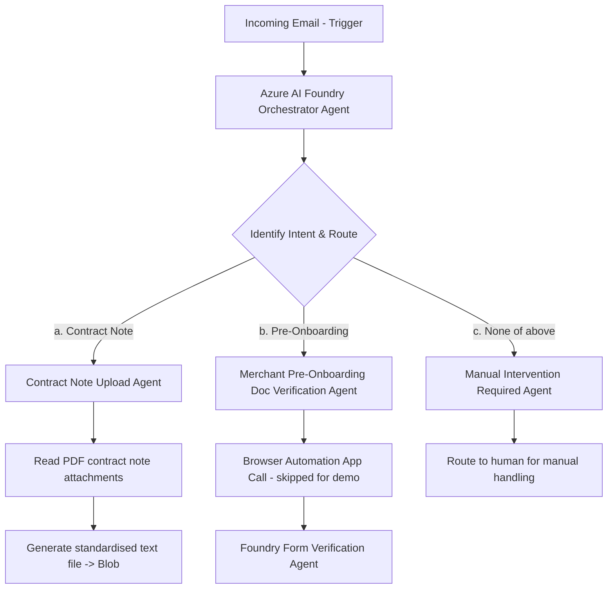

# Agentic Email Processing — Solution Plan

> Customer-facing plan describing **what** we are building, **why** the chosen
> approach, and the **phased** delivery. Step-by-step implementation is captured
> separately in [README.md](./README.md) and added incrementally as each phase is built.

---

## 1. Goal

Automatically process incoming emails using an **agentic** architecture on Azure.
When an email arrives, an AI orchestrator understands the **intent** and routes it
to the correct specialist agent:

- **(a) Contract Note** → read the PDF attachment, generate a standardised text file, upload to storage.
- **(b) Merchant Pre-Onboarding** → verify documents (browser automation step is *skipped for the demo*).
- **(c) None of the above** → route to a human for manual handling.

---

## 2. Recommended Architecture — Hybrid (Logic Apps + Azure AI Foundry Agents)

The customer asked for an **agentic** implementation. Both Azure Logic Apps and
Foundry Agents can technically do this, but each is best at a different job:

| Layer | Tool | Why |
|-------|------|-----|
| **Read the mail (trigger)** | **Azure Logic Apps** (Office 365 Outlook connector) | Native "When a new email arrives" trigger, attachment handling, retries — no custom code. Foundry agents do **not** watch a mailbox. |
| **Orchestrator + intent routing** | **Azure AI Foundry Agent** | The genuinely *agentic* decision layer — classifies intent and routes dynamically. |
| **Specialist agents** | **Azure AI Foundry Agents** (Connected Agents) | Reasoning + tool calls (read PDF, generate file, verify form). |
| **Deterministic actions** | Logic Apps actions / agent tools | Reliable, auditable side-effects (upload to Blob, notify a human). |

**Why not pure Logic Apps?** It becomes a rules-based workflow, not truly agentic.
**Why not pure Foundry?** You would hand-build the mailbox listener (Graph webhook +
Functions) — more code, slower to demo.
**Hybrid** gives the customer real agentic reasoning while using the right tool for
event-driven email integration.

### Flow diagram

---

## 3. Environment & Naming Standards

| Setting | Value |
|---------|-------|
| Cloud region | **Central India** (`centralindia`) |
| Subscription | _set per environment (not stored in repo)_ |
| Resource group | `agentic-email-processing` |
| Naming convention | Readable names, suffix **`-ks`** (no random GUIDs) |

### Resource names

| Resource | Name | Notes |
|----------|------|-------|
| Resource group | `agentic-email-processing` | |
| Azure AI Foundry (AI Services) resource | `foundry-ks` | |
| Foundry project | `email-agentic-ks` | |
| Model deployment | `gpt-mini-ks` | model chosen below |
| Storage account | `agenticemailks` | ⚠️ Storage account names **cannot contain hyphens** (3–24 lowercase alphanumeric). This is the one exception to the `-ks` rule. |
| Blob container (input) | `incoming-attachments` | |
| Blob container (output) | `contract-notes-output` | |
| Document Intelligence | `docintel-ks` | optional, recommended for reliable PDF parsing |
| Logic App (Phase 2) | `logic-email-ks` | |

### Model selection

- **Requested:** a GPT‑5‑series "mini" model.
- **Reality:** GPT‑5‑series models are region-limited and are typically **not yet
  available in Central India**. Verify in the portal model catalog first.
- **Recommended fallback (available in Central India):** **`gpt-4.1-mini`**
  (or `gpt-4o-mini`) — fast and cost-effective, ideal for a PoC.
- The deployment is named `gpt-mini-ks` so the underlying model can be swapped
  without renaming downstream references.

---

## 4. Delivery Phases

| Phase | Description | Status |
|-------|-------------|--------|
| **Phase 1** | **Provision foundation (Portal)** — Foundry project, model, storage, Doc Intelligence | ▶️ In progress |
| Phase 2 | Email ingestion (Logic Apps) — Outlook trigger, attachments → Blob, call orchestrator | ⬜ Planned |
| Phase 3 | Foundry agents — orchestrator + 3 specialist agents (Connected Agents) | ⬜ Planned |
| Phase 4 | Wire actions back — Blob output, human notification | ⬜ Planned |
| Phase 5 | Test & verify — 3 test emails, one per branch | ⬜ Planned |

> Deployment approach for the demo: **Azure Portal / click-ops**. Infrastructure-as-Code
> (Bicep/azd) can be added later for production hardening.

---

## 5. Decisions & Scope

- Mailbox source: **Outlook / Microsoft 365 (Exchange Online)**.
- Orchestration: **most agentic** — Foundry orchestrator classifies intent and routes.
- Contract Note output target: **Azure Blob Storage**.
- Browser automation (merchant onboarding) is **skipped for the demo** per the flow diagram.
- Network: public access for the demo; managed identity preferred over keys where possible.

## 6. Future Considerations (post-demo)

1. Move provisioning to **Bicep/azd** for repeatable deployments.
2. Add **tracing & evaluation** (Foundry observability) for the agents.
3. Robust **error handling / dead-letter** for failed emails.
4. Tighten auth to **managed identity** end-to-end (Logic Apps → Foundry → Blob).
