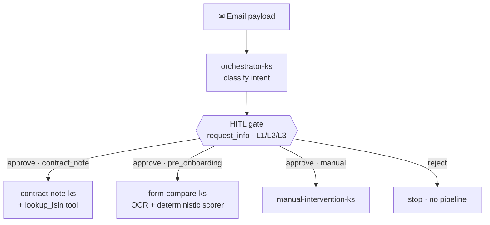
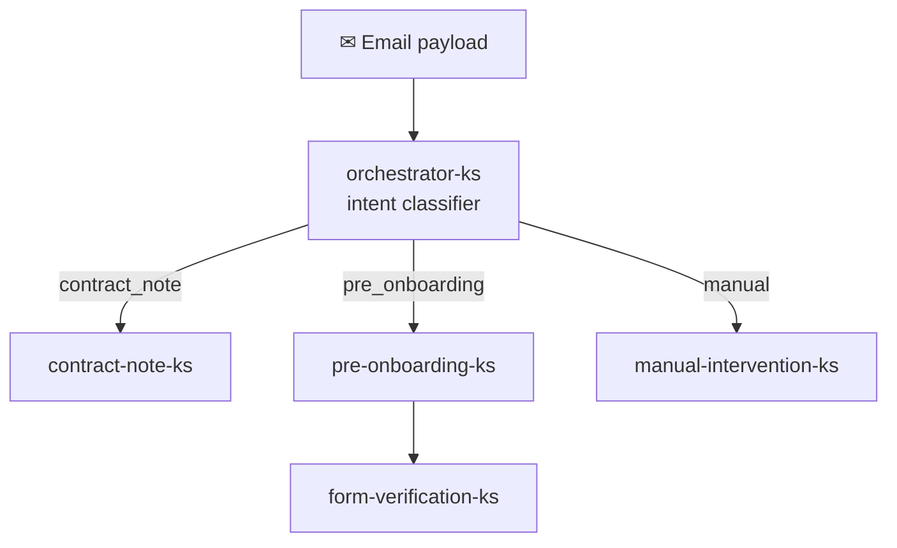

# Agentic Email Processing — Implementation Guide

Step-by-step implementation. See [PLAN.md](./PLAN.md) for the architecture and
overall plan. This guide is built **phase by phase**; only the active phase is
detailed below.

**Environment**

| Setting | Value |
|---------|-------|
| Data region | Central India (`centralindia`) |
| Model region | Sweden Central (`swedencentral`) — Central India is PTU-only |
| Subscription | _(set your own at deploy time — not stored in repo)_ |
| Resource group | `agentic-email-processing` |
| Naming suffix | `-ks` (readable names, no GUIDs) |

---

## v2 — Microsoft Agent Framework runtime (current) ✅

The agent runtime has been **rebuilt on the open-source Microsoft Agent Framework
(MAF)**. Instead of Foundry-hosted agents called over the Agents Service REST API (v1),
the agents now run **in-process** and are wired into a **true MAF `Workflow` graph** —
executors connected by switch-case edges, with a **native human-in-the-loop gate** and
**file-backed checkpointing**. The model is still served by Foundry (`gpt-mini-ks`);
only the orchestration moved into code.

### What changed vs v1

| | v1 (Foundry-hosted) | v2 (Microsoft Agent Framework) |
|---|---|---|
| Agent runtime | Remote agents in the Foundry project (`azure-ai-agents`) | In-process `Agent` objects (`agent-framework`) |
| Orchestration | Code-driven routing after a classify call | A real MAF `Workflow` graph (executors + switch-case edges) |
| Human approval | — | **Native HITL** — the workflow pauses on `request_info` |
| Durability | — | **`FileCheckpointStorage`** — a checkpoint per superstep |
| Tools | Code Interpreter (server-side) | Real in-process tool `lookup_isin` (NSE/BSE security master) |

### Workflow graph



The **orchestrator** classifies the email intent (no tools). The run then pauses at
**one** human-in-the-loop gate whose level is set by the intent — 🔴 **L1** contract note
(final sign-off), 🟠 **L2** onboarding (maker review), 🟢 **L3** manual (exception check).
On approval, **switch-case edges** route to the matching specialist executor, which runs
the existing deterministic pipeline; on reject the run stops. Every superstep is
checkpointed to file-backed storage, and the gate auto-decides after the review window
(~15 min in the UI) so nothing hangs.

> Four executors actually run the graph (`orchestrator-ks`, `contract-note-ks`,
> `form-compare-ks`, `manual-intervention-ks`). Two further prompts ship in `agents/`
> (`pre_onboarding.md`, `form_verification.md`) for a future multi-step onboarding flow
> but are not wired into the current graph.

### New / changed files

| File | Purpose |
|------|---------|
| [`dashboard/workflow.py`](./dashboard/workflow.py) | The MAF `Workflow`: executors, switch-case routing, native `request_info` HITL gate, `FileCheckpointStorage`, sync queue-bridge driver |
| [`dashboard/maf_agents.py`](./dashboard/maf_agents.py) | Builds in-process `Agent` objects from the `agents/*.md` prompts; real `lookup_isin` tool; `AzureOpenAIChatClient` (`gpt-mini-ks`) |
| [`dashboard/hitl.py`](./dashboard/hitl.py) | Human-in-the-loop review queue + decision/audit bridge; L1/L2/L3 level labels; review-window timeouts |
| [`dashboard/app.py`](./dashboard/app.py) | Rewired to drive the workflow (`/api/stream`), forward SSE, and expose the HITL endpoints |
| [`dashboard/doc_extract.py`](./dashboard/doc_extract.py) | Shared blob + Document Intelligence extraction — now **retried with backoff** on transient transport resets |
| [`aboutus.html`](./aboutus.html) | Standalone “About” page (also embedded in the dashboard) explaining the v2 runtime |

---

## Phase 1 — Provision foundation (Bicep) ✅ Deployed

Phase 1 is deployed as **Infrastructure-as-Code** (Bicep) instead of manual portal
clicks, so it's repeatable. Templates live in [`infra/`](./infra):

| File | Purpose |
|------|---------|
| [`infra/main.bicep`](./infra/main.bicep) | Subscription-scope entry point — creates the resource group and deploys the resources module |
| [`infra/resources.bicep`](./infra/resources.bicep) | All Phase 1 resources (Storage + containers, Foundry account + project + model, Document Intelligence) |
| [`infra/main.bicepparam`](./infra/main.bicepparam) | Parameter values (no secrets / subscription IDs) |

### Deploy / redeploy

```powershell
# 1. Sign in and select the target subscription (ID is NOT stored in the repo)
az login
az account set --subscription <your-subscription-id>

# 2. Deploy (subscription scope creates the resource group too)
az deployment sub create `
  --name phase1-emailagentic `
  --location centralindia `
  --template-file infra/main.bicep `
  --parameters infra/main.bicepparam
```

The deployment is idempotent — re-running it reconciles to the template.

### Region note (important)

**Central India is PTU-only** for Azure OpenAI models (no pay-as-you-go
`Standard`/`GlobalStandard`). To avoid provisioned-capacity cost for the PoC:

- **Data resources** (Storage, Document Intelligence) → **Central India** (data stays in India).
- **Model** → **`gpt-5.4-mini`** deployed as **GlobalStandard** (pay-as-you-go, global routing)
  on a Foundry account in **Sweden Central**.

### What got created

| Resource | Name | Region | Notes |
|----------|------|--------|-------|
| Resource group | `agentic-email-processing` | Central India | |
| Foundry (AI Services) account | `foundry-ks` | Sweden Central | subdomain `agentic-email-foundry-ks` |
| Foundry project | `email-agentic-ks` | Sweden Central | |
| Model deployment | `gpt-mini-ks` | (global) | `gpt-5.4-mini` v2026-03-17, GlobalStandard, capacity 20 |
| Storage account | `agenticemailks` | Central India | Standard_LRS |
| Blob container (input) | `incoming-attachments` | | |
| Blob container (output) | `contract-notes-output` | | |
| Document Intelligence | `docintel-ks` | Central India | subdomain `agentic-email-docintel-ks` |

### Deployment outputs (for Phases 2–3)

| Item | Value |
|------|-------|
| Foundry endpoint | `https://agentic-email-foundry-ks.cognitiveservices.azure.com/` |
| Foundry project | `email-agentic-ks` |
| Model deployment name | `gpt-mini-ks` (model `gpt-5.4-mini`) |
| Storage account | `agenticemailks` |
| Input container | `incoming-attachments` |
| Output container | `contract-notes-output` |
| Document Intelligence endpoint | `https://agentic-email-docintel-ks.cognitiveservices.azure.com/` |

### Phase 1 verification ✅

- [x] Resource group `agentic-email-processing` created.
- [x] Foundry account `foundry-ks` + project `email-agentic-ks` created (Sweden Central).
- [x] Model deployment `gpt-mini-ks` (`gpt-5.4-mini`, GlobalStandard) — **Succeeded**.
- [x] Storage account `agenticemailks` with `incoming-attachments` + `contract-notes-output`.
- [x] Document Intelligence `docintel-ks` created.

---

## Phase 2 — Email ingestion (Logic Apps, Bicep) ✅ Deployed

A **Consumption Logic App** (`logic-email-ks`) handles the event-driven email
integration. It is deployed as Bicep into the existing resource group:

| File | Purpose |
|------|---------|
| [`infra/phase2.bicep`](./infra/phase2.bicep) | Logic App + Office 365 Outlook + Azure Blob API connections |
| [`infra/logic-workflow.json`](./infra/logic-workflow.json) | The workflow definition (trigger → loop → blob → call orchestrator) |
| [`infra/phase2.bicepparam`](./infra/phase2.bicepparam) | Parameter values (no secrets) |

### What the workflow does

1. **Trigger** — *When a new email arrives (V3)* (Office 365 Outlook), Inbox, attachments included.
2. **For each attachment** — if the file ends in `.pdf`, **Create blob** into the
   `incoming-attachments` container and collect its path.
3. **Compose payload** — `{ subject, from, bodyPreview, body, attachmentBlobs }`.
4. **Call orchestrator agent** — when `orchestratorAgentId` is set, POST the payload to
   the Foundry agents endpoint (`/threads/runs`) using the Logic App's **managed identity**.

### Deploy / redeploy

```powershell
az deployment group create `
  --resource-group agentic-email-processing `
  --template-file infra/phase2.bicep `
  --parameters infra/phase2.bicepparam
```

### ⚠️ One-time manual step (cannot be automated)

The **Office 365 Outlook** API connection requires an interactive OAuth consent. After
the first deploy, open the **Azure Portal → Resource group → `office365-ks` connection
→ Edit API connection → Authorize**, sign in with the mailbox account, and save. Until
this is done the email trigger will not fire. (The Azure Blob connection uses the
storage key fetched at deploy time and needs no manual step.)

### What got created

| Resource | Name | Notes |
|----------|------|-------|
| Logic App (Consumption) | `logic-email-ks` | System-assigned managed identity enabled |
| Office 365 Outlook connection | `office365-ks` | **Needs manual Authorize** (see above) |
| Azure Blob connection | `azureblob-ks` | Uses storage key (fetched via `listKeys` at deploy) |

The Logic App's managed identity is granted **Cognitive Services User** on the Foundry
account/project so it can call the orchestrator agent.

---

## Phase 3 — Foundry agents (intent classifier + leaf specialists) ✅ Deployed

Foundry agents are **data-plane** objects (they live inside the project, not in ARM),
so they **cannot** be expressed in Bicep. The IaC equivalent is a versioned script that
reads instruction files and (re)creates the agents idempotently.

| File | Purpose |
|------|---------|
| [`agents/deploy_agents.py`](./agents/deploy_agents.py) | Creates the 5 agents (idempotent) — orchestrator classifier + 4 leaf specialists |
| [`agents/requirements.txt`](./agents/requirements.txt) | `azure-ai-agents`, `azure-identity` |
| [`agents/orchestrator.md`](./agents/orchestrator.md) | Orchestrator instructions (intent classification only) |
| [`agents/contract_note.md`](./agents/contract_note.md) | Contract Note Upload agent |
| [`agents/pre_onboarding.md`](./agents/pre_onboarding.md) | Merchant Pre-Onboarding agent |
| [`agents/form_verification.md`](./agents/form_verification.md) | Foundry Form Verification agent |
| [`agents/manual.md`](./agents/manual.md) | Manual Intervention agent |

### Agent graph (intent classifier + code-driven routing)



The orchestrator is a **pure intent classifier** — it returns
`{ "intent": "contract_note | pre_onboarding | manual", "reason": "…" }` and calls no
tools. The **routing/delegation is performed in code** (see the dashboard and
[`agents/test_orchestrator.py`](./agents/test_orchestrator.py)): the matching specialist
is invoked, and for onboarding the extracted fields are chained into
`form-verification-ks`. All five agents are **leaves**.

> **Why not the Foundry “Connected Agents (classic)” tool?** It fails server-side on
> this Agents Service endpoint/model (generic `server_error`, no run steps) and is
> superseded by the `2025-11-15-preview` workflows feature. Code-driven routing keeps
> every hop reliable and fully traceable.

`contract-note-ks` and `form-verification-ks` have the **Code Interpreter** tool for
formatting/validation; `orchestrator-ks`, `pre-onboarding-ks` and
`manual-intervention-ks` have no tools.

### Prerequisites

The identity running the script needs the **Cognitive Services User** role on the
Foundry account (data action `Microsoft.CognitiveServices/*`):

```powershell
$acct = az cognitiveservices account show -g agentic-email-processing -n foundry-ks --query id -o tsv
az role assignment create --assignee <your-object-id> --role "Cognitive Services User" --scope $acct
```

### Create / update the agents

```powershell
pip install -r agents/requirements.txt
python agents/deploy_agents.py
```

The script prints `ORCHESTRATOR_AGENT_ID=...`. Wire it into the Logic App so Phase 2 can
call the orchestrator:

```powershell
az deployment group create `
  --resource-group agentic-email-processing `
  --template-file infra/phase2.bicep `
  --parameters infra/phase2.bicepparam orchestratorAgentId=<asst_...>
```

---

## Phase 4 — Contract note processing ✅

When the orchestrator classifies an email as **contract_note**, a pipeline turns the
attached broker contract notes (PDF or image) into the pipe-delimited **PIS LEC upload
files** and writes them to the `contract-notes-output` container.

Per attachment: download from `incoming-attachments` (managed identity) → extract text +
tables with **Azure AI Document Intelligence** (`prebuilt-layout`) → `contract-note-ks`
normalises it into structured JSON → ISINs resolved from the security master. All notes
are then grouped **by exchange × Buy/Sale** (per the spec: *exchange-wise files, one
purchase + one sales file per broker per trade date*) and written as `H`/`T` records.

| File | Purpose |
|------|---------|
| [`agents/contract_note.md`](./agents/contract_note.md) | Extraction-agent instructions — emits strict JSON (no arithmetic/formatting) |
| [`dashboard/contract_format.py`](./dashboard/contract_format.py) | Deterministic `H`/`T` formatter (spec layout, `Qty*(Rate±Brokerage)`, grouping, ISIN lookup) |
| [`dashboard/contract_pipeline.py`](./dashboard/contract_pipeline.py) | Blob → Document Intelligence → agent → format → upload (SSE events) |
| [`agents/security_master.csv`](./agents/security_master.csv) | Seed scrip-name → ISIN master (**replace with the bank's authoritative master**) |
| [`agents/test_contract_note.py`](./agents/test_contract_note.py) | Offline formatter self-test + `--live <file>` end-to-end test |

**Record spec** (from the customer instructions doc): `H` = 12 fields
(client, trade date, contract-note no, GST, cess, exchange levy, STT, stamp duty,
others, trade count, total); `T` = 9 fields (client, contract-note no, `S`/`P`, ISIN,
qty, rate, brokerage rate, amount). Header total reconciles to the trade amounts plus
all header charges — verified to the cent against both sample files.

> **Prerequisite:** the running identity needs **Cognitive Services User** on the
> Document Intelligence account (`docintel-ks`) and **Storage Blob Data Contributor** on
> `agenticemailks`.

```powershell
# Validate deterministic formatting (offline):
python agents/test_contract_note.py
# Full extract -> map on a real contract note (Document Intelligence + agent):
python agents/test_contract_note.py --live "<path-to-pdf-or-image>"
```

---
---

## Live Operations Dashboard (UI) ✅

A lightweight, single-screen dashboard that visualises the **whole flow in real time**
— email received → orchestrator classifies intent → **human-in-the-loop approval gate**
→ which specialist executor fired → per-agent output → final result — so you can test
and observe routing (and exercise the live HITL gate) without sending a real email or
reading terminal logs. It also surfaces the **real Logic App run history**.

| File | Purpose |
|------|---------|
| [`dashboard/app.py`](./dashboard/app.py) | FastAPI backend: drives the MAF **workflow** per email, **SSE live-trace** stream, HITL review endpoints, Logic App run history |
| [`dashboard/workflow.py`](./dashboard/workflow.py) | MAF `Workflow` graph — executors, switch-case routing, native `request_info` HITL gate, file-backed checkpoints |
| [`dashboard/maf_agents.py`](./dashboard/maf_agents.py) | In-process `Agent` builders (from `agents/*.md`) + real `lookup_isin` tool |
| [`dashboard/hitl.py`](./dashboard/hitl.py) | Human-in-the-loop review queue, decision bridge, L1/L2/L3 levels + timeouts |
| [`dashboard/static/index.html`](./dashboard/static/index.html) | Single-page UI (vanilla JS + SSE): Live Flow, HITL approval cards, About tab |
| [`dashboard/requirements.txt`](./dashboard/requirements.txt) | `agent-framework-{core,azure-ai,openai}==1.0.0rc6`, `fastapi`, `uvicorn`, `azure-identity`, `azure-storage-blob`, `azure-ai-documentintelligence` |

### Run it

```powershell
az login                                   # data-plane auth (Cognitive Services User)
# Use an isolated venv — the Microsoft Agent Framework stack is pinned to rc6
python -m venv dashboard/.venv
dashboard/.venv/Scripts/Activate.ps1
pip install -r dashboard/requirements.txt
python -m uvicorn app:app --port 8000 --app-dir dashboard
# then open http://localhost:8000
```

### What's on screen

- **Simulate an email** (left) — pick a built-in sample (Contract Note / Merchant
  Pre-Onboarding / Manual) or paste a custom email body, then **Run through the flow**.
- **Live run trace** (centre) — a streaming timeline (Server-Sent Events): 📧 email
  received → ◎ orchestrator classifies → ⏸ **HITL gate** (the run pauses on an approval
  card; Approve / Reject / Re-route) → → routed-to-specialist → △ each agent's actual
  output → ✔ final JSON summary. A status pill animates idle → running → **paused** →
  completed / failed / rejected.
- **Routing map** (right) — the orchestrator → specialists flow diagram whose nodes
  **light up** as each executor fires.
- **Agent inventory** (left) and **Logic App runs** (right) — live from the workflow and
  the real Logic App run history (via `az rest`).

### API endpoints

| Endpoint | Returns |
|----------|---------|
| `GET /api/agents` | Agent inventory (name, model, tools) |
| `GET /api/samples` | Built-in sample email subjects |
| `GET /api/stream?sample=contract\|onboarding\|manual` | **SSE** live trace of one run — pauses at the HITL gate (also accepts `?text=<custom body>`) |
| `GET /api/hitl/queue` · `GET /api/hitl/history` | Pending review items / decided-review audit log |
| `POST /api/hitl/decision` | Approve / reject / re-route a paused run (resumes the workflow) |
| `GET /api/events/stream` · `GET /api/logicapp/runs` | Live trace of a real Logic App email run / recent Logic App runs |

### Security

No secrets or subscription IDs are written to disk — the subscription is read at request
time from `az account show`, and auth uses your `az login` identity.

---

_Phases 4–5 will be documented here as they are implemented._
