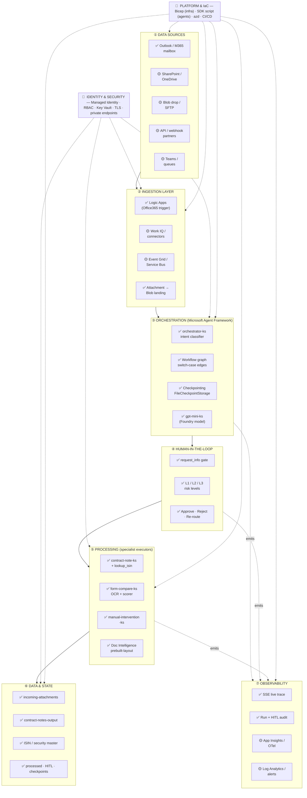
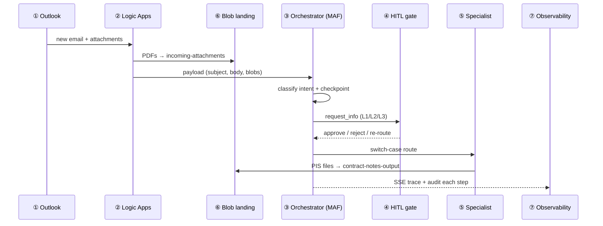

# Agentic Email Processing — Production-Grade Component Architecture

> Board-ready, layered component view of the solution. Each tier is a swappable
> band of components: **Data Sources → Ingestion → Orchestration (MAF) → Processing →
> Human-in-the-Loop → Data & State → Observability**, all riding on a shared
> **Identity / Security** and **Platform / IaC** foundation. The PoC today wires
> Outlook + Logic Apps + MAF; every other component is a clearly-marked extension slot.

Legend: ✅ live in PoC · 🟡 design-ready slot · 🔵 platform / cross-cutting.

---

## 1. Layered component architecture (the big picture)

---

## 2. Layer-by-layer component catalogue

| # | Layer | Live components (PoC) | Extension slots | Job |
|---|-------|-----------------------|-----------------|-----|
| ① | **Data Sources** | Outlook / M365 mailbox | SharePoint, OneDrive, SFTP/Blob drop, partner webhooks, Teams, queues | Where work arrives |
| ② | **Ingestion** | Logic Apps (Office 365 V3 trigger) → attachments to Blob | Work IQ connectors, Event Grid, Service Bus, Graph webhooks | Capture event, persist payload, hand off |
| ③ | **Orchestration (MAF)** | `orchestrator-ks` classifier, Workflow graph, switch-case edges, checkpoints, `gpt-mini-ks` | Multi-agent fan-out, retries, sub-workflows | Decide intent, route, keep durable state |
| ④ | **Human-in-the-Loop** | `request_info` gate, L1/L2/L3 levels, approve/reject/re-route, review-window timeout | Teams adaptive cards, role-based approval | Risk-graded sign-off, no run hangs |
| ⑤ | **Processing** | `contract-note-ks` (+`lookup_isin`), `form-compare-ks` (OCR+scorer), `manual-intervention-ks`, Document Intelligence | Onboarding chain, browser automation, more specialists | Deterministic pipelines, side-effects |
| ⑥ | **Data & State** | `incoming-attachments`, `contract-notes-output`, security master, processed/HITL/checkpoints | Cosmos/SQL audit, vector index | Inputs, outputs, master data, durability |
| ⑦ | **Observability** | SSE live trace, run + HITL audit, dashboard | App Insights / OpenTelemetry, Log Analytics, alerts | See, audit, alert on every step |
| 🔵 | **Identity & Security** | Managed identity, RBAC, no keys on disk, TLS 1.2 | Key Vault, private endpoints, VNet | Least-privilege, auditable secrets |
| 🔵 | **Platform & IaC** | Bicep (Phase 1–2), SDK script (agents) | azd, CI/CD pipeline | Repeatable, versioned deploys |

---

## 3. Request flow (swimlane)

---

## 4. Production hardening checklist

- **Identity:** managed identity everywhere; no keys/subscription IDs on disk.
- **Resilience:** checkpoint per superstep, retry-with-backoff on Doc Intelligence, HITL auto-decide on timeout.
- **Auditability:** processed/HITL/checkpoint journals + SSE trace; ready for App Insights + Log Analytics.
- **Network (next):** private endpoints + VNet, Key Vault for connection secrets.
- **Deploy:** Bicep for control-plane, versioned SDK script for data-plane agents — fully repeatable.

> PoC = ① Outlook ⮕ ② Logic Apps ⮕ ③ MAF ⮕ ④ HITL ⮕ ⑤ specialists ⮕ ⑥ storage, with ⑦ live trace. Yellow slots scale it to a multi-source, multi-tenant production grade.
